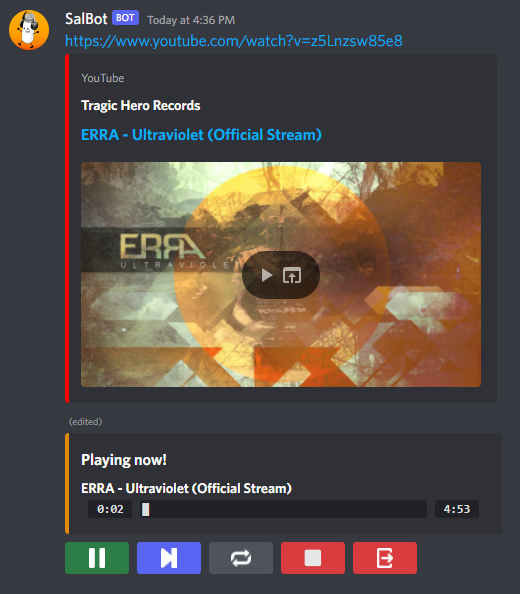
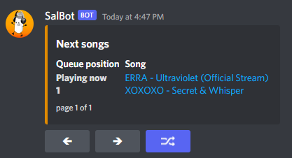

# SalBot
This is a discord music bot made in python that plays songs using youtube links, search strings, and spotify links, including playlists and albums.
This bot was made using the library [Nextcord](https://github.com/nextcord/nextcord) in order to implement every discord related functionality.

# Features
- Plays songs from youtube and spotify, including playlists from both platforms and albums from spotify.
- Queue system, with buttons to skip, loop, pause, disconnect, and shuffle the songs in the queue.
- Command that displays the lyrics of a requested song.
- Command that sends through DM the audio file of a youtube video (limited to 8 MB file size due to discord file size restriction).
- Dedicated command to play any playlist or album with the songs already shuffled (">playrandom" command or just ">pr").
- This bot has a database connection that saves the songs that the users play, and is then used in a command to show the top songs played by each user and server.
- Log files that store every command that is requested to the bot.

# Usage examples
- ">play (name of the song)"
- ">play (youtube link)"
- ">play (spotify link)"
- ">loop"
- ">skip"  
...Shows commands available by using ">help" command

# Requirements
It is required to have a working spotify developer account in order to use spotify related commands. It is also required to have a database of your own in order to use the bot properly because the ">play" command will save data on the database and if the connection is not right the bot can crash.
In addition to the libraries imported in every python file, it is also necessery to install ffmpeg (audio player) in your machine and the library PyNaCle (no error will pop up if this library is not installed, the bot will simply not connect to any voice channel).

# Images
  

